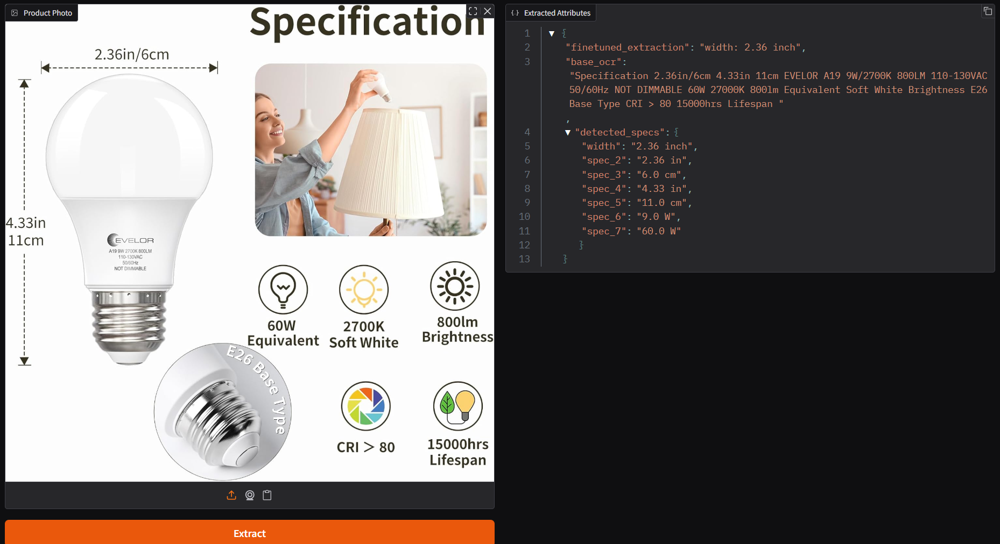
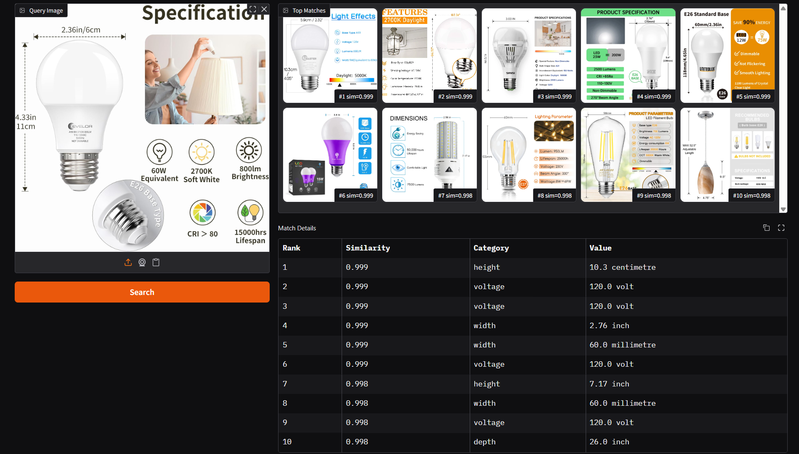
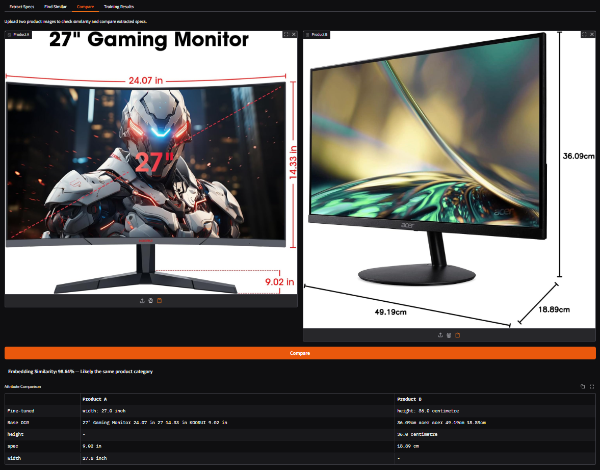
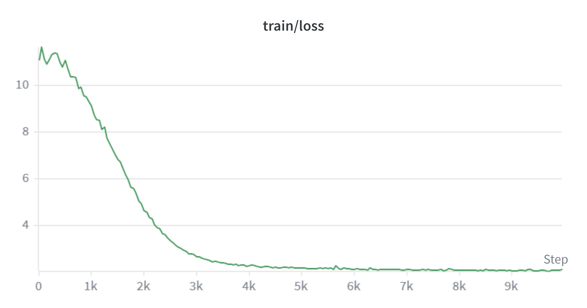

# Product Matcher

Upload product photos to automatically extract specs, find matching listings across a catalog of 182k products, or compare two items side by side.

Built with a dual model architecture; fine tuned Florence-2 for reading specs from images, and a SigLIP contrastive model for visual similarity search over a FAISS index.



## Features

**Extract Specs** — Upload a product image and the system reads visible text (weight, dimensions, voltage, wattage) using fine tuned Florence-2 model with LoRA, combined with base model OCR for full text coverage.



**Find Similar** — Upload product image to search 182,408 indexed products by visual similarity. Uses SigLIP embeddings with a learned contrastive projection head and FAISS approximate nearest neighbor search.



**Compare Items** — Upload two product images to see an embedding similarity score and a side-by-side comparison of extracted specs.

## Arch

```
Product Image
  |---> Florence-2 (LoRA fine-tuned) ---> Structured Specs (value + unit)
  |         + base model OCR         ---> Full visible text ---> Parsed specs
  |
  \---> SigLIP + Projection Head ---> 256-d Embedding ---> FAISS Index ---> Top-K Similar
                                                              |
                                         Gradio UI <----------/
```

## Approach

### Observations

- large dataset (~20 GB of product images, 263k labeled rows).
- Around 90k unique images in the test set, with ~18k containing no readable text at all.
- Dataset is imbalanced, e.x. item_weight dominates while attributes like depth and voltage are underrepresented. Train set for depth has ~1,600 unique values while the test set has ~28,000, and this also exists across other attributes.
- Only ~3% of images (7,598 / 252,853) have multiple attributes labeled. Ran into issues where naive single output model will miss most of the information visible on a product image.
- Many product images have specs printed in tiny text, overlapping labels, or stylized fonts that make OCR unreliable without a vision language model.

stratified splits were used to address this imbalance --> (70/15/15 by entity type) so every attribute is represented proportionally in train, val, and test sets.

### Why Florence-2 Instead of BERT + OCR

A two stage pipeline is most commonly used: run an OCR model i.e. PaddleOCR, TrOCR, etc. to extract text, then feed that text into a BERT transformer to classify the entity value. Works but has drawbacks:

- OCR errors propagate; if the OCR misreads 2.36 as 236 or misses a unit, BERT won't recover.
- Compute cost: TrOCR expensive at scale
- Lost visual context: pure text models can't use layout, font size, or position cues that help distinguish a product's primary spec from background text

Instead Florence-2 can be used, a vision language model that both processes the image and generates text. Fine-tuning with LoRA lets it learn to extract structured specs directly from the image in a single pass w/ no separate OCR step needed. Base model's OCR capability is still used as a second pass with LoRA disabled to catch anything the fine-tuned model misses.

### Pipeline Overview

```
Raw Data (CSV)
  ├── entity_name ──────────────────────────────────────────────┐
  ├── entity_value ─→ parse (value + unit) ─→ training target   │
  └── image_link ─→ download image ─→ preprocessing             │
                                          │                     │
                                          ▼                     │
                                   Florence-2 + LoRA            │
                                   (fine-tune on <OCR> task)    │
                                          │                     │
                              ┌───────────┴───────────┐         │
                              ▼                       ▼         │
                     Fine-tuned pass           Base model pass  │
                     (primary spec)            (full OCR +      │
                                                caption)        │
                              │                       │         │
                              └───────┬───────────────┘         │
                                      ▼                         │
                              Regex parsing ◄───────────────────┘
                              (number + unit pairs)
                                      │
                                      ▼
                              All extracted specs
```

For the similarity search side:

```
Product Image ─→ SigLIP backbone ─→ Projection Head ─→ 256-d embedding
                   (frozen, then       (768 → 512 → 256,
                    partially           L2-normalized)
                    unfrozen)                │
                                             ▼
                                     FAISS IVFFlat Index
                                     (182,408 vectors)
                                             │
                                             ▼
                                     Top-K similar products
```

### Decisions

1. Dual-pass extraction: fine tuned model tends to focus on the primary spec, what it was trained on, so a second pass run with the base Florence-2, LoRA layers disabled, to get full OCR text and detailed caption. A regex parser then finds all number & unit pairs across both outputs. doubles the number of specs extracted per image.

2. LoRA instead of full fine tuning: with only 0.9% of parameters trainable, training takes ~3.5 hours on a single T4 instead of days. OCR capability is preserved as is its core weights.

3. Two-stage contrastive training: Stage 1 trains only the projection head in 3 epochs so it learns a reasonable embedding space before Stage 2 unfreezes the last 2 SigLIP transformer blocks for e2e fine-tuning via 9 epochs. Thus preventing catastrophic forgetting of SigLIP's pretrained features.

4. SupCon loss over triplet loss: Supervised Contrastive Loss uses all positives and negatives in a batch simultaneously, which is more sample efficient than triplet mining and converges faster with the limited GPU budget.

## How It Works

### Attribute Extraction

Florence-2-large (0.77B params) fine-tuned with LoRA (rank 32, alpha 64) on attention projections 
- only 0.9% of parameters are trainable. primary product spec id'd, while the base model performs full OCR to capture all visible text. 
- regex parser then extracts all number + unit pairs from the combined output.

Trained on the Amazon ML Challenge 2024 dataset (263k labeled product images) for 10,000 steps with mixed precision on an NVIDIA T4. Final loss: 2.03 train / 2.00 val.

### Product Similarity

Visual similarity uses SigLIP-base as a frozen backbone with a learned projection head 768 → 512 → 256 dims, L2-normalized. Trained with Supervised Contrastive Loss, SupCon & temperature 0.07 in 2 stages:

1. (3 epochs): Train projection head only, backbone frozen
2. (9 epochs): Unfreeze last 2 SigLIP transformer blocks, fine-tune e2e with lower learning rate

All 182k training images are embedded and indexed in a FAISS IVFFlat index with inner product similarity for fast approximate search.

### Training Runs

Training tracked with Weights & Biases:



| Model | Steps/Epochs | Final Train Loss | Final Val Loss | Hw | Time |
|-------|-------------|-----------------|----------------|----------|------|
| Florence-2 LoRA | 10,000 steps | 2.03 | 2.00 | T4 16GB | ~3.5h |
| SigLIP Contrastive | 12 epochs | 4.54 | 4.52 | T4 16GB | ~24h |

## Dataset

[Amazon ML Challenge 2024](https://www.kaggle.com/datasets/danishlaraib/amazon-ml-challenge-2024) — 263,859 product images with structured attribute labels including:

- Item weight (kg, lb, oz, g)
- Dimensions — height, width, depth (cm, in, ft, mm)
- Voltage (V, mV, kV)
- Wattage (W, kW)
- Item volume (ml, L, gal, fl oz)

Images downloaded async with rate limiting, parsed into structured JSON, and split 70/15/15 by entity type

## Stack

PyTorch, Transformers, PEFT (LoRA), open-clip-torch, FAISS, Gradio, Weights & Biases, albumentations

## Run Locally

```bash
# install dependencies
pip install -r requirements.txt

# download dataset, images
python -m data.download
python -m src.data.parse_attributes

# train models; requires GPU
python -m src.training.train_florence2
python -m src.training.train_contrastive

# build FAISS index
python -m scripts.build_index

# launch app
python -m app.gradio_app
```